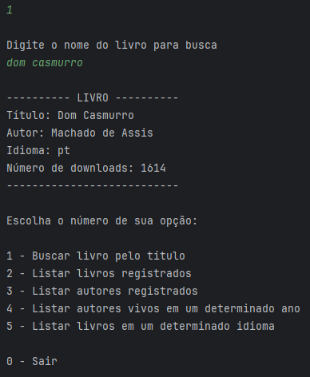

<p align="center">
	
</p>

Catálogo de Livros, o LiterAlura, que oferece interação textual (via console) com os usuários, proporcionando no mínimo 5 opções de interação. Permite realizar solicitações a uma API de livros, manipular dados JSON, armazená-los em um banco de dados e, por fim, a filtrar e mostrar os livros e autores de interesse. Realizado durante a formação Back-end da [Oracle Next Education (ONE)](https://www.oracle.com/br/education/oracle-next-education/).

## Índice

- [Pré-requisitos](#pré-requisitos)
- [Funcionalidades](#funcionalidades)
- [Instalação](#instalação)
- [Como Usar](#como-usar)
- [Exemplo de Uso](#exemplo-de-uso)
- [Autora](#autora)
- [Licença](#licença)

---

### Pré-requisitos

- Java 17 ou superior
- Spring Boot (Utilizando o [Spring Initializr](https://start.spring.io/)
- [IntelliJ IDEA](https://www.jetbrains.com/pt-br/idea/)

### Funcionalidades

- Buscar livro pelo título
- Listar livros registrados
- Listar autores registrados
- Listar autores vivos em um determinado ano
- Listar livros em um determinado idioma

### Instalação

1. Clone o repositório para sua máquina local:

    ```bash
    git clone https://github.com/GessycaBorges/desafio-java-literalura
    ```

2. Configure seu banco de dados Postgres, inserindo as variáveis de ambiente (pode substituir diretamente no arquivo application.properties):
    - `DB_HOST`, host.
    - `DB_NAME`, nome do banco de dados.
    - `DB_USER`, nome do seu usuário.
    - `DB_PASSWORD`, sua senha.

3. Crie o banco com o nome informado acima em `DB_NAME`.

### Como Usar
- Ao executar LiteraluraApplication, você verá um menu para escolher a conversão que deseja realizar.
  - Digite o número correspondente à ação escolhida. 
  - Após a execução do primeiro item, o resultado será exibido e salvo no banco de dados.

### Exemplos de Uso

#### 1. Buscar livro pelo título

- **Passo 1**: Execute o programa `LiteraluraApplication`.
- **Passo 2**: O menu de opções será exibido:

```bash
Escolha o número de sua opção:

1 - Buscar livro pelo título
2 - Listar livros registrados
3 - Listar autores registrados
4 - Listar autores vivos em um determinado ano
5 - Listar livros em um determinado idioma

0 - Sair
```

- **Passo 3**: Digite a opção 1.
- **Passo 4**: Em seguida, digite o nome do livro que deseja buscar.

O resultado da busca será exibido:



- **Passo 5**: Finalize o programa digitando a opção 0 para finalizar ou outra opção que desejar.

#### 2. Listar livros registrados

- **Passo 1**: Execute o programa `LiteraluraApplication` e o menu será exibido.
- **Passo 2**: Digite a opção 2.

 O resultado da busca será exibido (trará os livros buscados anteriormente na opção 1):


#### 3. Listar autores registrados

- **Passo 1**: Execute o programa `LiteraluraApplication` e o menu será exibido.
- **Passo 2**: Digite a opção 3.

 O resultado da busca será exibido:


#### 4. Listar autores vivos em um determinado ano

- **Passo 1**: Execute o programa `LiteraluraApplication` e o menu será exibido.
- **Passo 2**: Digite a opção 4.
- **Passo 3**: Em seguida, digite o ano que deseja buscar.

 O resultado da busca será exibido, os autores vivos no ano digitado:


#### 5. star livros em um determinado idioma

- **Passo 1**: Execute o programa `LiteraluraApplication` e o menu será exibido.
- **Passo 2**: Digite a opção 5.
- **Passo 3**: Em seguida, digite o idioma que deseja buscar.

 O resultado da busca será exibido, os livros disponíveis nesse idioma:


### Autora

<a href="https://www.linkedin.com/in/gessycaborges/">
 <br />
 <sub><a>Gessyca Borges</a></sub></a> <a href="https://www.linkedin.com/in/gessycaborges/" title="Gessyca"></a>
 <br />

 ---

### Licença

Este projeto é de código aberto e pode ser utilizado livremente, sob a licença MIT.
